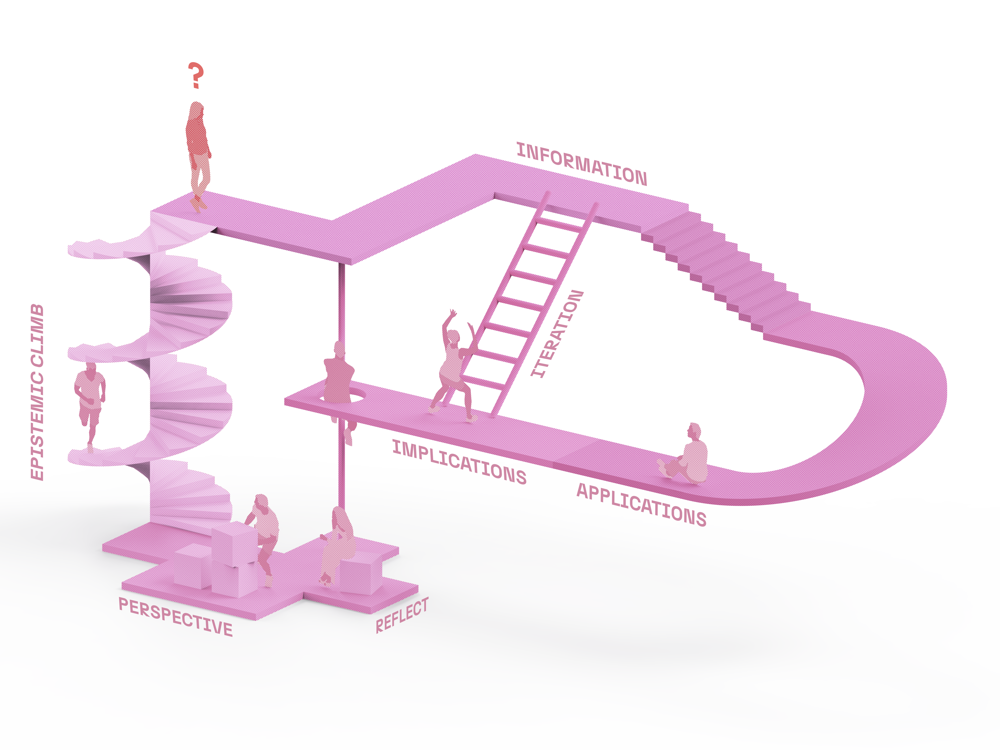
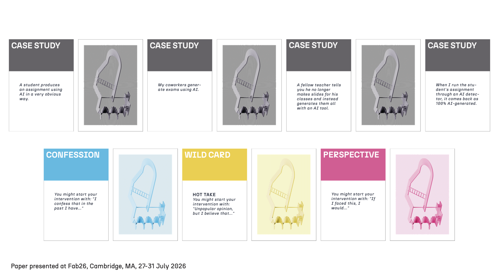

# Friction first FAB26 Boston

The content in this repo has been created for the developement of the article [Friction First: A Toolkit for Teaching Critical Thinking in an Al-Saturated Classroom]() and for the complementary workshop [Friction First: Co-Building an Open Playbook for Critical Thinking Education in the Al Age](https://fab26.fabevent.org/programs/schedule?day=2026-07-28) presented at [FAB26](https://fab26.fabevent.org/) in Boston, Masachussetts.

## The framework

## Pedagocgical playbook

## How to access the resources in this repo

The contents are divided in the following folders:

- `diagram`: Which contains the assents and files used for the creation of the diagram "" used in the paper

- `presentations`: which contains the presentations for the workshop and paper presentation

- `website`: the interactive 3D diagram viewer, deployed to GitHub Pages

## About us

We are <a href="https://www.linkedin.com/in/sofia-llàcer-caro/" target=_blank>Sofia LLàcer Caro</a> from **Universitat Autònoma de Barcelona** and <a href="https://www.linkedin.com/in/jorgemunozzanon/" target=_blank>Jorge Muñoz Zanón</a> from **Generalitat de Catalunya** we are currently based in Barcelona. If you have any interest in collaborating with us to recommend or enhance our work don't hesitate to write to us, we will be happy to chat. 